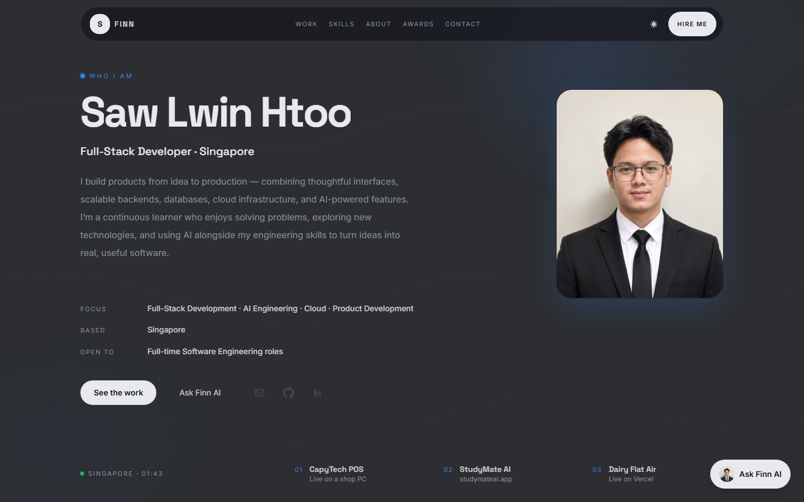
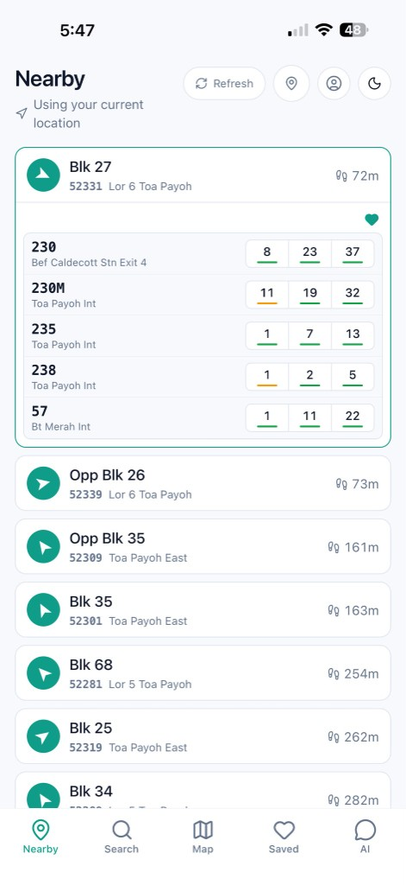
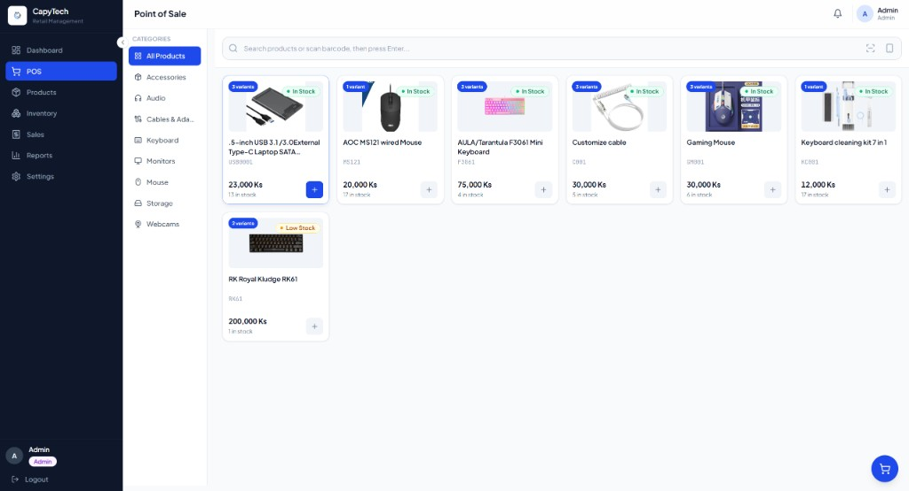
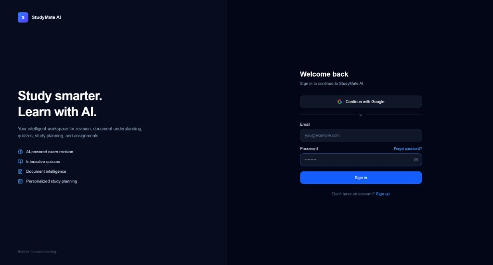
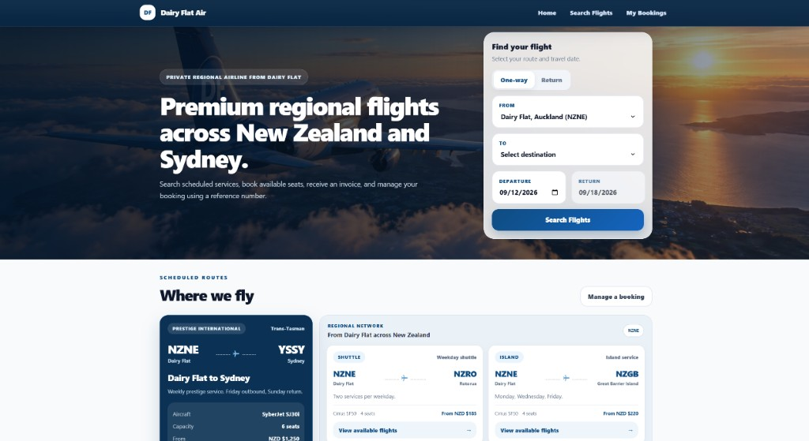
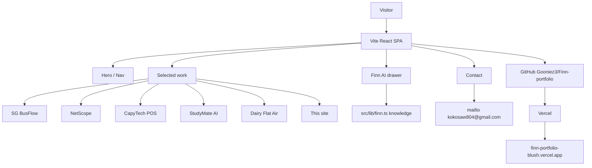

# Finn Portfolio

**A personal site for Saw Lwin Htoo (Finn) — shipped products, real case notes, and a recruiter-facing walkthrough of full-stack and AI work.**

This is not a gallery of coursework demos. The site presents six builds: SG BusFlow, NetScope, a shop-computer POS, a live LangGraph learning product, a regional airline booking platform, and this site. Copy, screenshots, and Finn AI answers come from those systems rather than placeholder projects.

[](https://react.dev/)
[](https://www.typescriptlang.org/)
[](https://vitejs.dev/)
[](https://tailwindcss.com/)
[](https://www.framer.com/motion/)
[](https://vercel.com/)

**Live application:** [finn-portfolio-blush.vercel.app](https://finn-portfolio-blush.vercel.app/)

## Product overview

Recruiters and hiring managers should be able to scan who Finn is, what he has shipped, and how to reach him without hunting through a long resume. The site is a single Vite page with section anchors: identity first, then live products, capabilities, education, certificates, and contact.

Work cards are the proof. SG BusFlow is a Singapore bus app with live arrivals and Ask BusFlow. NetScope is a Windows desktop network diagnostic. CapyTech POS is a local-first till on a computer accessories shop PC — not a cloud SaaS. StudyMate AI is live at [studymateai.app](https://studymateai.app). Dairy Flat Air is live on Vercel. This repository is the public record of that work.

## Core features

| Capability | What it provides |
| --- | --- |
| **Identity-first hero** | Name, role, focus, location, and CTAs before any decorative type. |
| **Shipped work** | Six products with kickers, blurbs, engineering notes, stack chips, GitHub, and live links where they exist. |
| **3D work gallery** | Desktop coverflow with `perspective` / `rotateY`; stacked cards on mobile. Selected screenshots use `object-contain` so UI is not cropped. |
| **Finn AI** | A drawer that answers from a local knowledge base — SG BusFlow, NetScope, POS, StudyMate, Dairy Flat Air, education, GitHub, LinkedIn, and contact — not a hosted LLM. |
| **Capabilities** | Full-stack, AI engineering, and production notes tied to the same shipped systems. |
| **Path and awards** | PSB diploma, Massey BInfSc (CS + IT, 8.8 / 9 GPA, conferred August 2026), IBM RAG & Agentic AI and DevOps PDFs. |
| **Contact** | Email, GitHub, LinkedIn, and a form that opens the visitor’s mail app to `kokosaw804@gmail.com`. |
| **Motion** | Lenis smooth scroll, Framer Motion reveals, magnetic buttons, scroll progress, and a desktop cursor spotlight. All of that is off under `prefers-reduced-motion`. |
| **Theme** | Dark / light toggle persisted in the page shell. |

## Product walkthrough

### Hero



### Shipped products

| SG BusFlow | NetScope |
| --- | --- |
|  |  |

| CapyTech POS | StudyMate AI | Dairy Flat Air |
| --- | --- | --- |
|  |  |  |

- **SG BusFlow** — nearby stops, live minutes from LTA DataMall, walk-plus-bus journeys, and Ask BusFlow. Next.js and Expo share one FastAPI API. The assistant does not invent a time. Repo: [SG-BusFlow](https://github.com/Gooniez3/SG-BusFlow).
- **NetScope** — ping, DNS, traceroute, TCP ports, and LAN discovery in one Windows desktop window, with optional SQLite history and a rule-based session explainer. Repo: [NetScope](https://github.com/Gooniez3/NetScope).
- **CapyTech POS** — checkout, variants, inventory, invoices on the shop PC. Database prices, row-level stock locks, idempotent charges, phone barcode scanning on shop Wi-Fi, USB backup. Repo: [capytech-pos](https://github.com/Gooniez3/capytech-pos).
- **StudyMate AI** — LangGraph routing, page-aware PDF RAG, streaming across Groq / Gemini / OpenRouter. Live: [studymateai.app](https://studymateai.app). Repo: [studymate-ai](https://github.com/Gooniez3/studymate-ai).
- **Dairy Flat Air** — owned timetable, honest search, IANA timezones, idempotent schedule generation, booking lookup with no account. Live: [dairy-flat-air-booking.vercel.app](https://dairy-flat-air-booking.vercel.app). Repo: [dairy-flat-air-booking](https://github.com/Gooniez3/dairy-flat-air-booking).

## How it works



There is no application database and no server API. Product copy lives in `src/data/site.ts`. Finn AI scores keyword overlap against a fixed answer list in `src/lib/finn.ts` and returns the best match. The contact form never posts to a backend.

## Finn AI

Finn AI is a briefing drawer, not StudyMate.

| Behavior | Detail |
| --- | --- |
| **Knowledge** | Who Finn is, why hire him, stack, SG BusFlow, NetScope, CapyTech POS, StudyMate AI, Dairy Flat Air, this site, Massey / PSB, IBM certs, GitHub, LinkedIn, contact. |
| **Matching** | Lowercased question, keyword hits, highest score wins. |
| **Fallback** | If nothing matches, it lists the topics it can brief. |
| **Not included** | No LLM provider, no RAG, no streaming, no stored chats. |

That keeps answers aligned with the public repos and avoids inventing client or product details.

## Technology stack

| Area | Technologies |
| --- | --- |
| **UI** | React 19, TypeScript, Vite 8, Tailwind CSS 4 |
| **Motion** | Framer Motion, Lenis |
| **Content** | `src/data/site.ts`, IBM PDFs under `public/certs/` |
| **Finn AI** | Client-side keyword matcher in `src/lib/finn.ts` |
| **Deployment** | GitHub `master` → Vercel |

## Project structure

```text
Finn-portfolio/
|-- public/
|   |-- certs/              # IBM RAG and DevOps PDFs
|   |-- work/               # Product screenshots
|   `-- portrait.jpg
|-- src/
|   |-- components/         # Nav, Hero, Work, Finn, Contact, Footer, ...
|   |-- context/            # Theme
|   |-- data/site.ts        # Profile, projects, skills, education
|   |-- hooks/useLenis.ts
|   |-- lib/finn.ts         # Finn AI answers
|   |-- App.tsx
|   `-- index.css
|-- index.html
`-- vite.config.ts
```

## Local development

### Prerequisites

- Node.js compatible with Vite 8
- npm

### Setup

```bash
git clone https://github.com/Gooniez3/Finn-portfolio.git
cd Finn-portfolio
npm install
npm run dev
```

Open [http://localhost:5173](http://localhost:5173). If that port is taken, Vite will offer the next one.

Validate a production build with:

```bash
npm run build
npm run preview
```

## Deployment

Production is [finn-portfolio-blush.vercel.app](https://finn-portfolio-blush.vercel.app/).

```text
Local development
       ↓
     GitHub master
       ↓
     Vercel
       ↓
finn-portfolio-blush.vercel.app
```

Framework preset is Vite. Build command is `npm run build`. Output directory is `dist`. There are no runtime environment variables.

## Reliability and engineering

- **Honest product copy:** CapyTech POS is described as a shop-computer / local-first till, not a hosted SaaS.
- **Uncropped selected shots:** the active work image uses `object-contain` so till, chat, and booking UI stay readable.
- **Reduced motion:** scroll progress, wave parallax, cursor spotlight, and reveal animations respect `prefers-reduced-motion`.
- **Contact without a backend:** the form builds a `mailto:` URL so messages go to `kokosaw804@gmail.com`.
- **Single-page sections:** nav uses in-page ids rather than a client router.

## License

Copyright © 2026 Saw Lwin Htoo. All rights reserved.

This repository is source-visible for portfolio and evaluation purposes. It is **not open source**, and no permission is granted to redistribute, modify, sublicense, sell, or commercially reuse substantial portions of the software without prior written permission. See [LICENSE](LICENSE) for the complete terms.

## Author

**Saw Lwin Htoo (Finn)**

Full-Stack Developer / Software Engineer focused on building modern web applications and AI-powered systems.

- GitHub: [@Gooniez3](https://github.com/Gooniez3)
- LinkedIn: [saw-lwin-htoo](https://www.linkedin.com/in/saw-lwin-htoo-664447415/)
- Live project: [finn-portfolio-blush.vercel.app](https://finn-portfolio-blush.vercel.app/)
- Related: [SG BusFlow](https://github.com/Gooniez3/SG-BusFlow) · [NetScope](https://github.com/Gooniez3/NetScope) · [StudyMate AI](https://github.com/Gooniez3/studymate-ai) · [CapyTech POS](https://github.com/Gooniez3/capytech-pos) · [Dairy Flat Air](https://github.com/Gooniez3/dairy-flat-air-booking)
